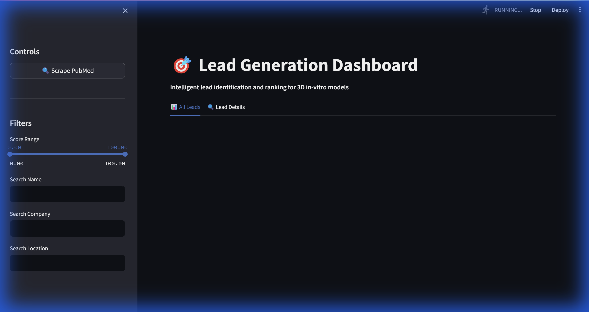
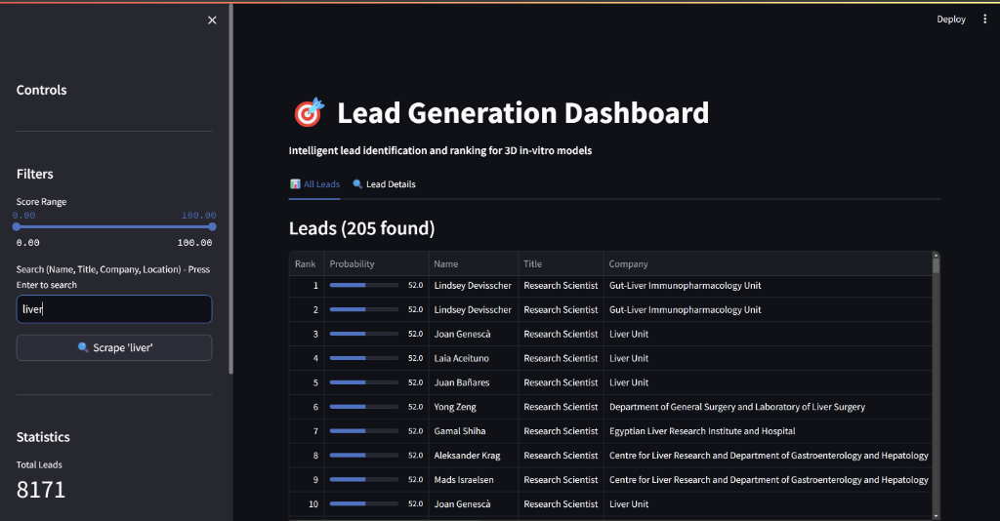
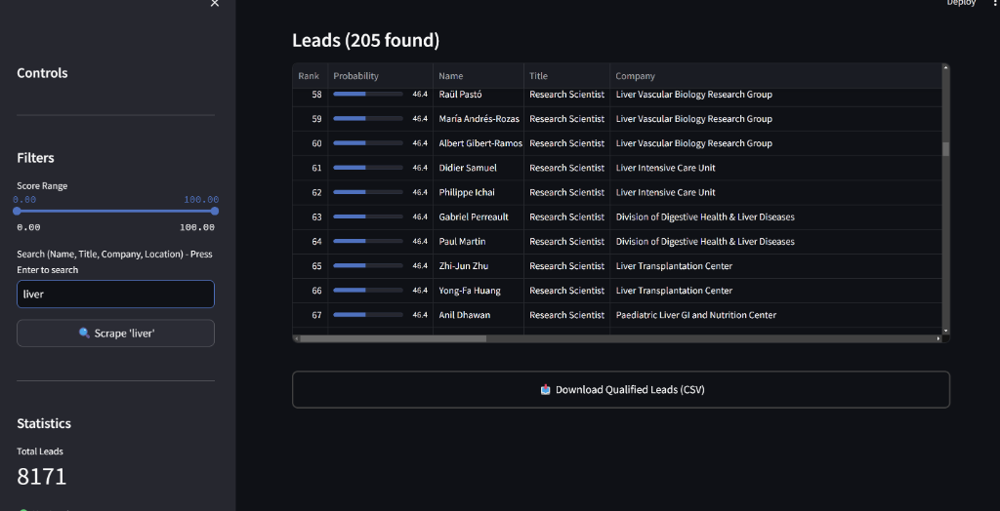

# 🧬 Lead Generation Web Agent

**Automated system for identifying and ranking high-value leads in the Biotech & Pharma sector.**


> **🚀 Live Demo**: [Click here to view the app](https://lead-generation-web-agent-pethbumskzqjnaxpwvr2bd.streamlit.app/)

## 🚀 Key Features

*   **Live Search**: Type "Liver", "Toxicology", or company names to scrape **PubMed** in real-time.
*   **Ranking**: Leads ranked (0-100) by Scientific Intent, Role Fit, and Company metrics.
*   **Data Export**: Clean CSV download with smart search links for easy outreach.

## 📸 Visuals

| Dashboard | Live Search |
|-----------|-------------|
|  |  |

## 🛠️ Quick Start

**Local:**
```bash
git clone https://github.com/Rajadi16/Lead-Generation-Web-Agent.git
pip install -r requirements.txt
streamlit run app.py
```

**Streamlit Cloud:**
*   Push to GitHub.
*   Deploy on [share.streamlit.io](https://share.streamlit.io/).
*   (Configured with `runtime.txt` for Python 3.11).

## 📄 License
Internal Tool for Euprime.
